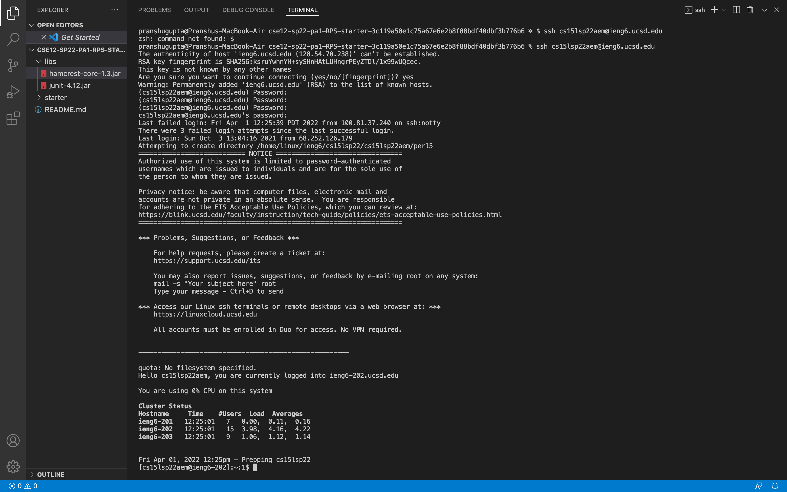
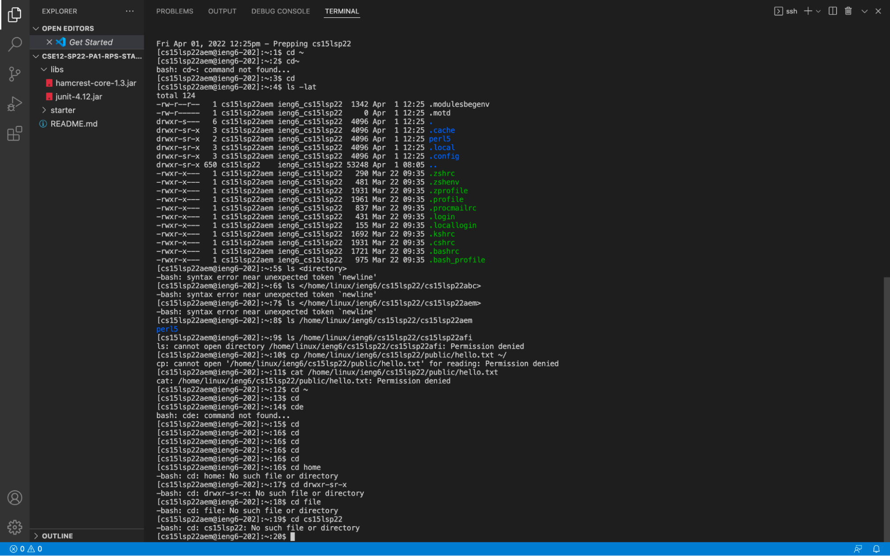
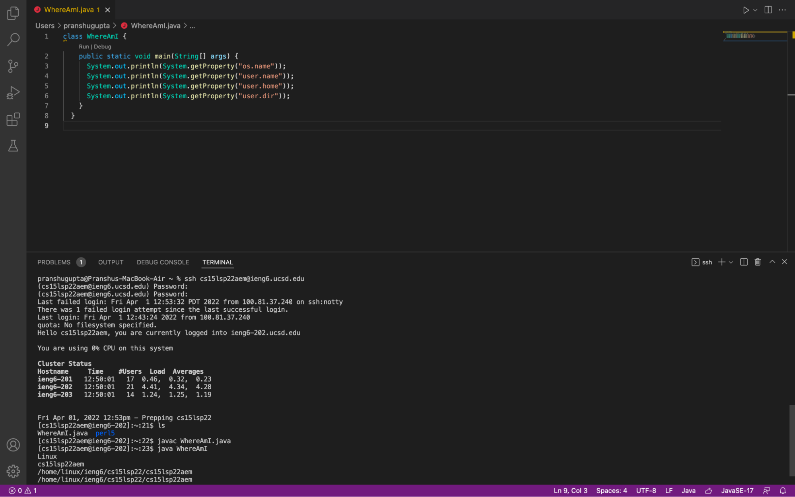
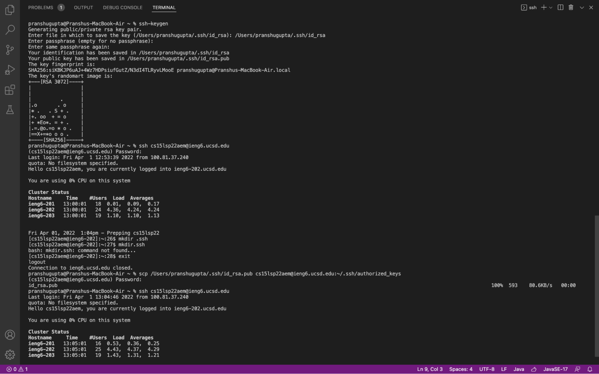
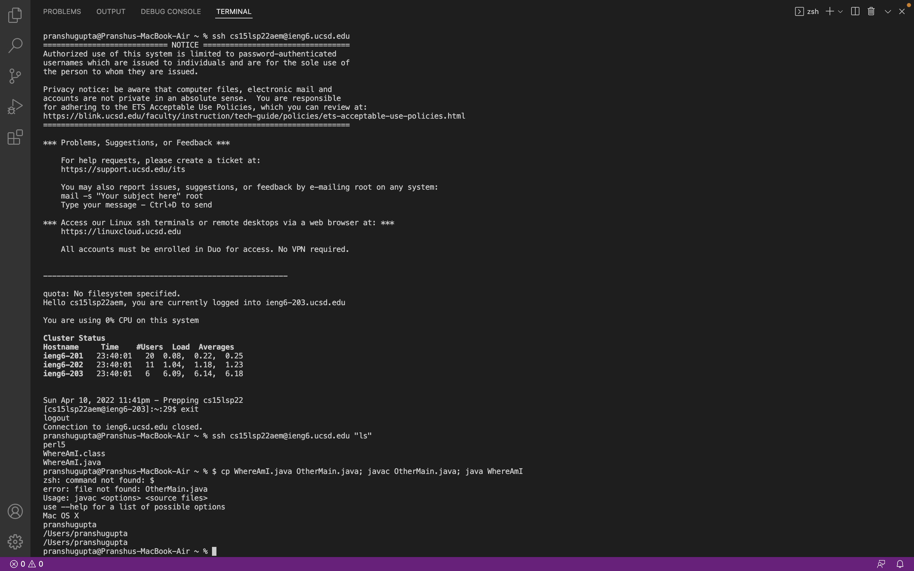

# Lab Report 1 - Week 2
## Installing VScode
The first step is to [install and run VScode.](https://code.visualstudio.com/download)

*Opening VScode*

## Connecting to the Remote Computer
The second step is to connect to the remote computer.
We do this by first opening the terminal (using Ctrl + \` or Terminal -> New Terminal).
Then we use command:

`$ ssh *Username*@ieng6.ucsd.edu`

Type yes on the next prompt and then enter your password.
You should now be connected to the remote computer.

*Connecting remotely to another PC*

## Trying Some Commands
There are many different commands we can try now that we are connected to the remote computer.
Some of these commands are cd, ls, pwd, mkdir, and cp.

*Trying Some Commands*

## Moving Files with scp
To move a file, use the command:

`scp *Filename* *Username*@ieng6.ucsd.edu:~/`

Now, upon logging back into ieng6, you should see this file in the home directory and be able to run it on the remote computer.

*Moving Files with scp*

## Setting up an SSH Key
Having to log back in each time is annoying, so we can set up an SSH key to log in for us.
Use command:

`$ ssh-keygen`

Do not enter a passphrase when prompted.
Log back into the remote computer using `$ ssh *Username*@ieng6.ucsd.edu` and enter your password again.
Then use command:

`$ mkdir .ssh`

Logout of the remote computer and use command:

`$ scp /Users/\<user-name\>/.ssh/id_rsa.pub *Username*@ieng6.ucsd.edu:~/.ssh/authorized_keys`

Now you can log in without having to type in your password each time.
  

*Setting an SSH Key*

## Optimizing Remote Running
We can write commands in quotes at the end of the ssh command to log in, run, and then exit the remote computer all in one go.
For example:

`$ ssh *Username*@ieng6.ucsd.edu "ls"`

We can use semicolons to run multiple commands on the same line.
For example:

`$ cp WhereAmI.java OtherMain.java; javac OtherMain.java; java WhereAmI`

We can use the up and down arrow keys to navigate between recently run commands.

*Optimizing Remote Running*
