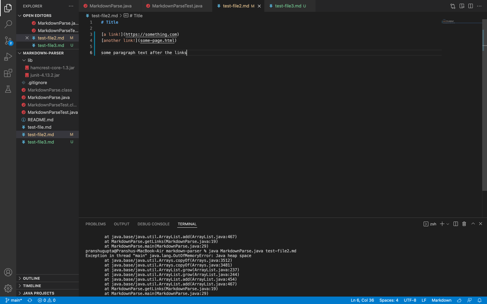

# Lab Report 2 - Week 4
## Bug Number 1 - Heap Error

The first bug we encountered was a heap error that was caused by an infinite loop. In order to fix this, we removed the unnecessary extra lines after the line with the link. This seemed to fix the error.

*Code Change for OutOfMemory Error*

[Link to First Error Inducing Test File](https://github.com/pranshug2704/markdown-parser/commit/da86dc83c0de379327b219f96d9fdd3af5439bc0)

The code ran with the heap error and took several moments to actually run due to the fact that the computer was processing an infinite loop.

*Symptom for OutOfMemory Error*

## Bug Number 2 - IndexOutOfBounds Error

The second bug we encountered was an index out of bounds error that was caused by the code trying to access items that weren't in the test file. In order to fix this, we added the open and closed brackets (). This seemed to fix the error.

*Code Change for IndexOutOfBounds Error*

[Link to Second Error Inducing Test File](https://github.com/pranshug2704/markdown-parser/commit/8a47669282020b8026001428094975d9019a76c0)

The code ran with the index out of bounds error and told us that the end was -1 even though the beginning was 0.

*Symptom for IndexOutOfBounds Error*

## Bug Number 3 - IndexOutOfBounds Error

The third bug we encountered was an index out of bounds error that was caused by the code trying to access items that weren't in the test file. In order to fix this, we added the closed bracket ). This seemed to fix the error.

*Code Change for IndexOutOfBounds Error*

[Link to Third Error Inducing Test File](https://github.com/pranshug2704/markdown-parser/commit/e5eaf81dbfcd18f18d52077524b5beae57b92758)

The code ran with the index out of bounds error and told us that the end was -1 even though the beginning was 16.

*Symptom for IndexOutOfBounds Error*
