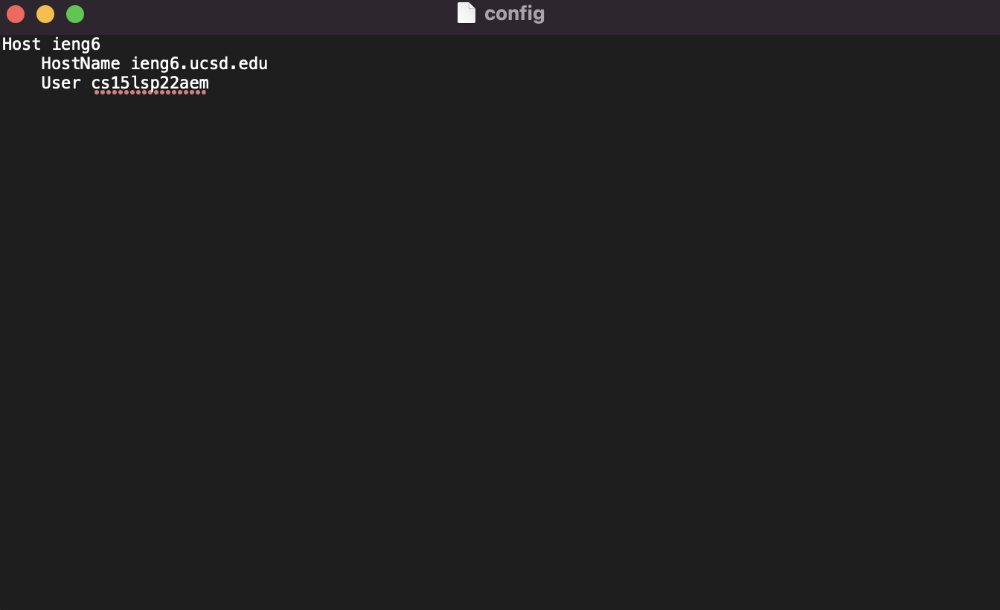
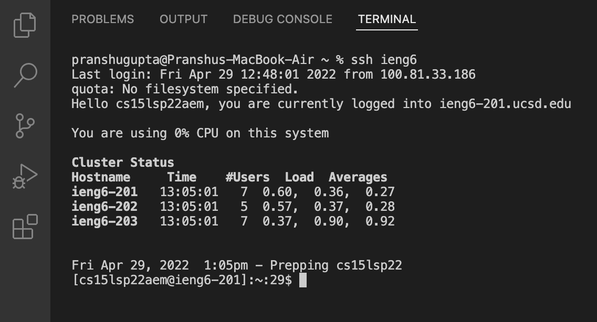
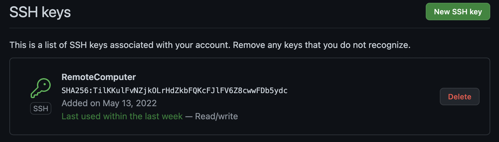
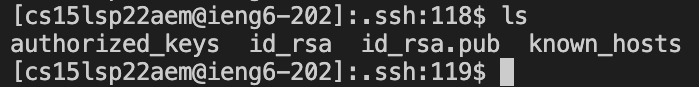
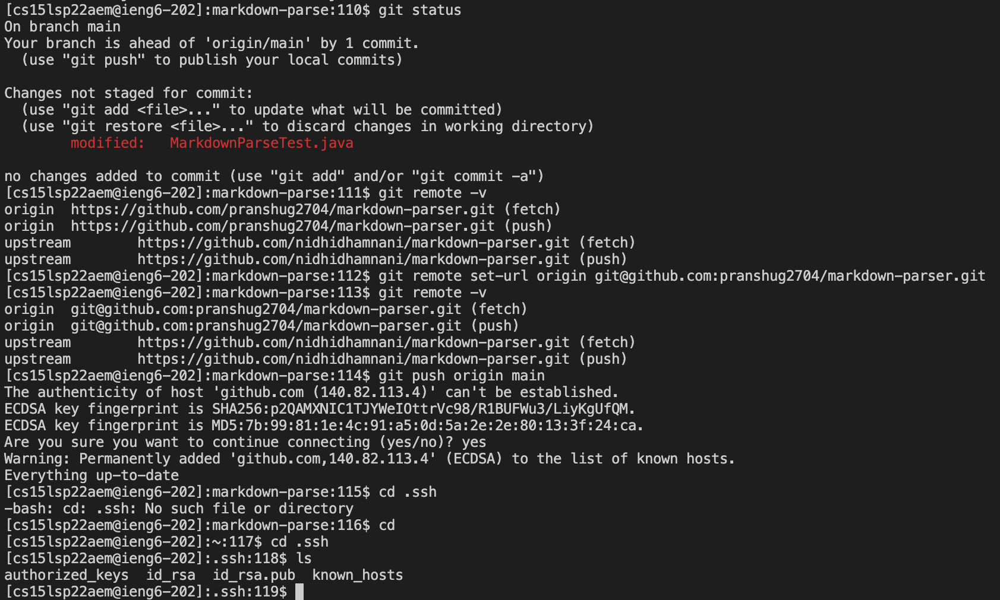
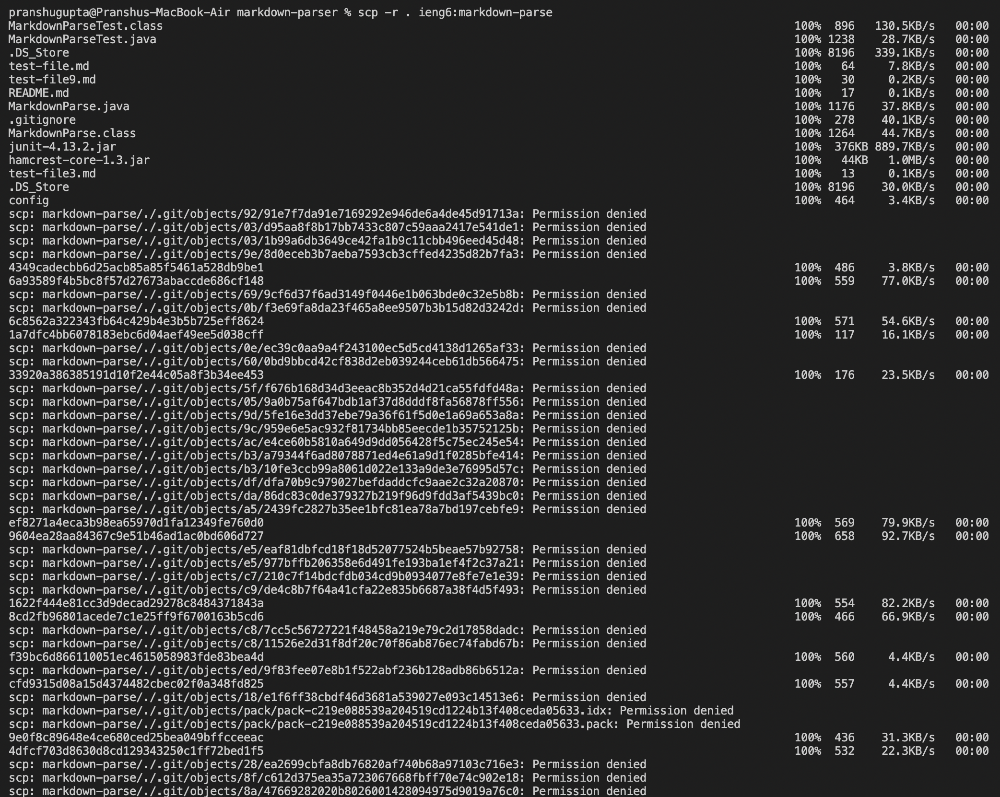
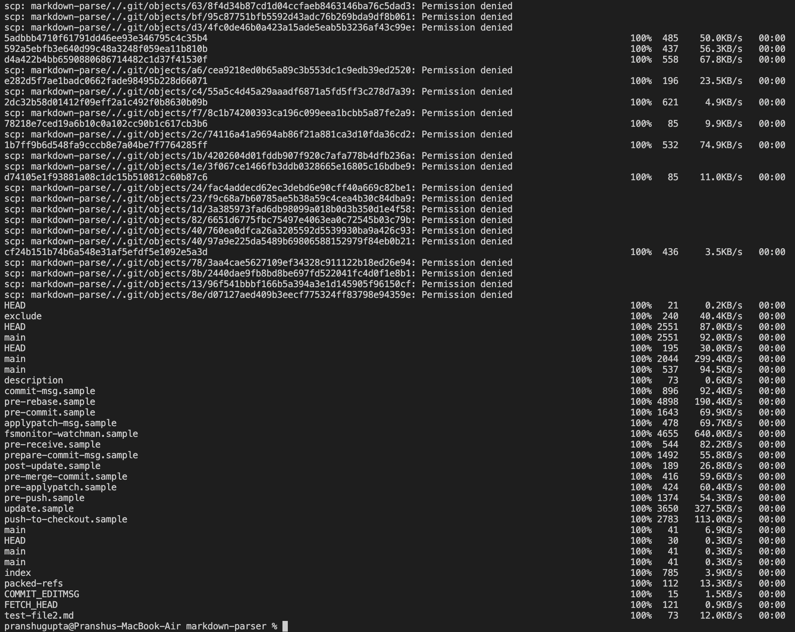
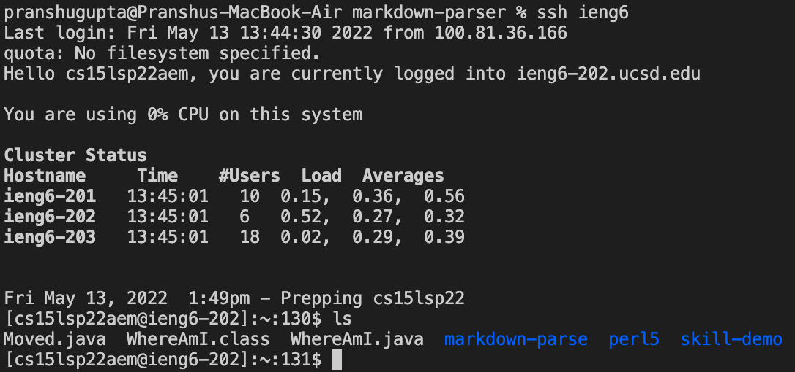
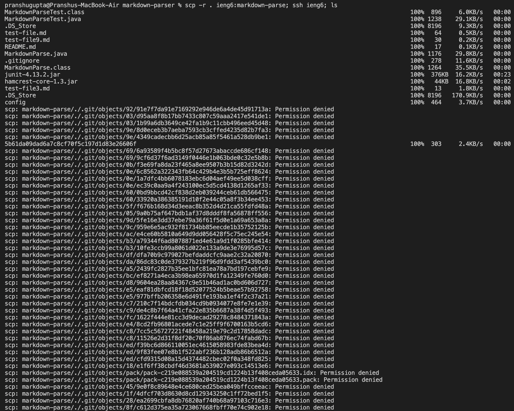

# Lab Report 3 - Week 6
## Streamlining ssh Configuration

*The .ssh/config file for streamlined login*

*Logging in using the new streamlined login*

*Copying a file to the remote computer with streamlined login*

## Setup Github Access from ieng6

*The public key as it is stored on Github*

*The private key stored on the remote computer*

*Git commands to commit and push a change to Github*

[Link to the commit from the remote computer](https://github.com/pranshug2704/markdown-parser/commit/f78c1b74200393ca196c099eea1bcbb5a87fe2a9)

## Copy whole directories with scp -r

*Copying a Whole Directory to the remote computer using scp -r*

*The file in the remote computer*

*Combining scp, ;, and ssh to copy the whole directory and run the tests in one line*
