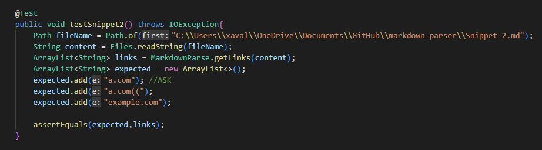
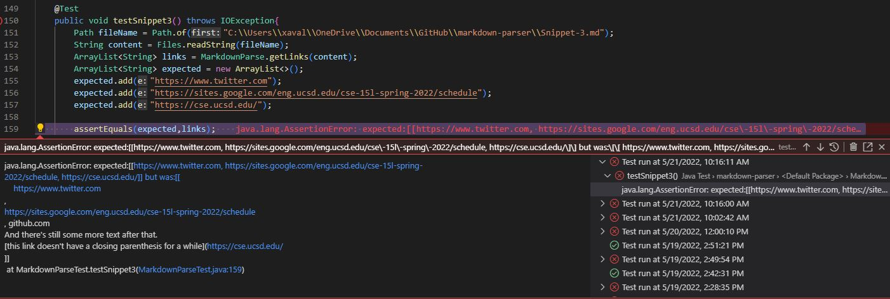
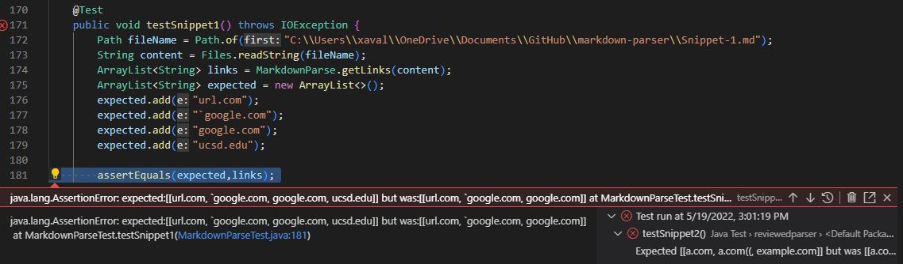
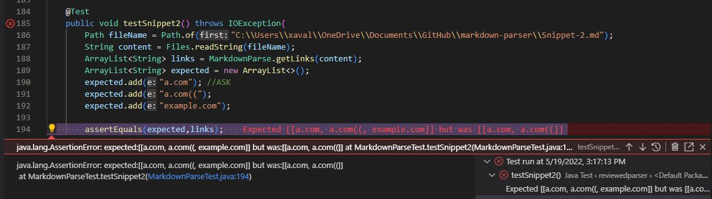
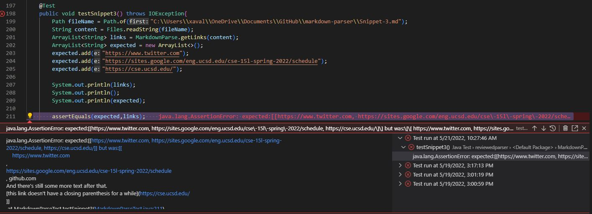

# Lab Report 4 - Week 8
## My Implementation

### Snippet 1

My program passed for Snippet 1 because it only finds the brackets and parentheses and skips other characters.

*The first test passes*

### Snippet 2

My program passed for Snippet 2 because it finds the first opening and first closing bracket and parenthesis in the file.

*The second test passes*

### Snippet 3

My program failed for Snippet 3 becasue my code finds the first set of brackets and parenthesis to find a legal link. Since the format of Snippet 3 includes links with no closing brackets, the changes include formatting the array correctly and implementing code where it skips the opening bracket or parenthesis if it doesn’t find a terminating bracket or parenthesis.

*The third test fails due to incorrect formatting*

## Week 7 Implementation
[Link to repository for reviewed parser](https://github.com/ohuynh21/markdown-parser)

### Snippet 1

*The first test fails due to a missing link from "links"*

### Snippet 2

*The second test fails due to a missing link from "links"*

### Snippet 3

*The third test fails due to incorrect formatting and unnecessary text in the links*
