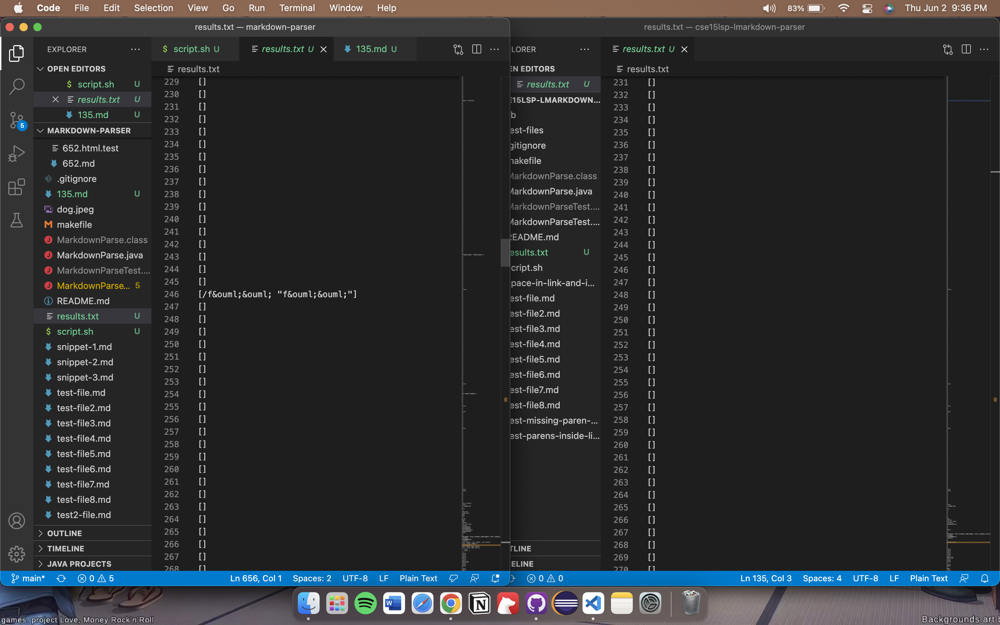
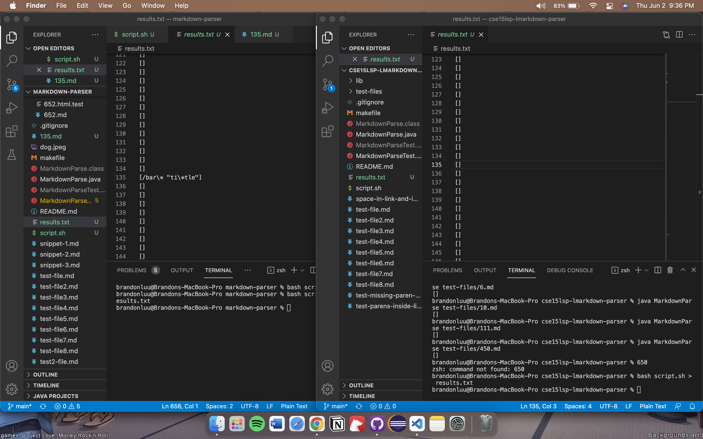
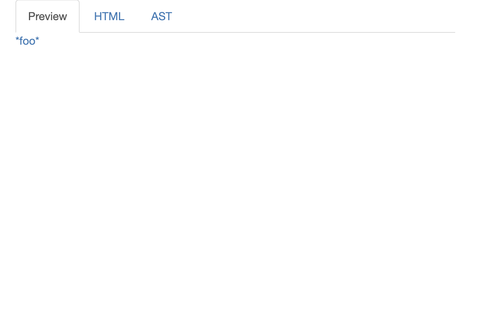
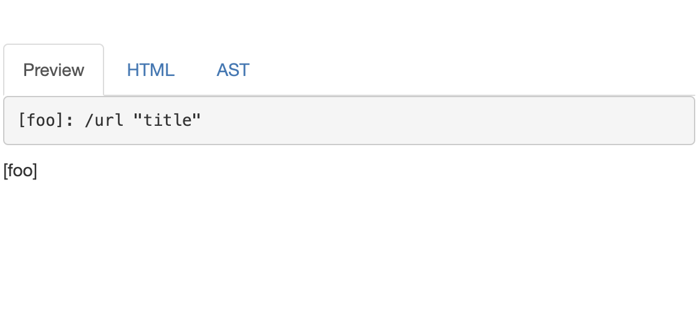
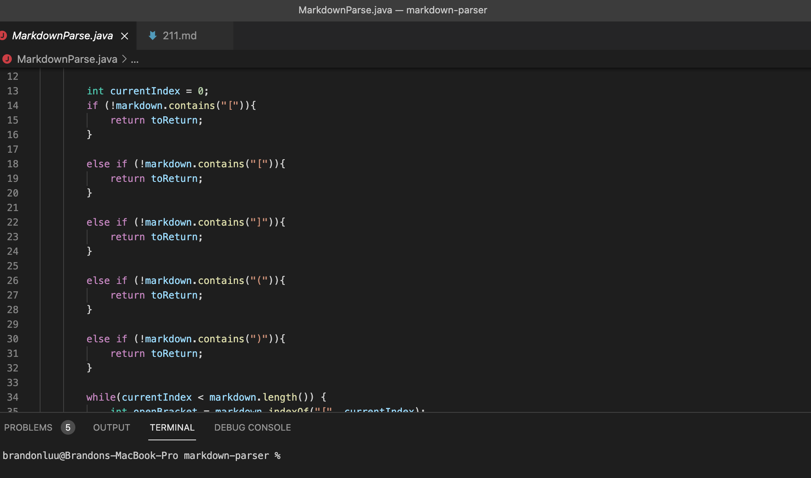

# Lab Report 5 Week 10

## Two tests with different outputs than expected

*The first test*

*The second test*

I found this by using the bash script and putting the output onto a new text file. For test file 135, my MarkdownParser returned an array with one value while the other MarkdownParser did not. In test file 246, my MarkdownParser returned a different array from the other MarkdownParser. 

> Note: The two images come from the files 159.md and 211.md. 
> Test 159.md can be found [here](https://github.com/brandoluu/markdown-parser/blob/main/test-files/159.md) 
> Test 211.md can be found [here](https://github.com/brandoluu/markdown-parser/blob/main/test-files/211.md).

The output for the two markdown files are:

*Output for the first test*

*Output for the second test*

As seen from the two images, there are no links. However when looking at the results from the earlier images, my MardownParser returned an array with links while the other one did not. Therefore there is a bug in my MarkdownParser. 

## Analyzing the bug in the code

A possible error is that my implementation does not check for a valid link even if there are parenthesis and brackets invovled. Before the loop to parse whatever is after the *[]*, there are checks to see if the correct brackets are present in the file as shown below:

*Checking for the correct brackets*

In order to make my implementation cleaner, it would be a good idea for me to add a check if the brackets after the first square brackets are valid, in order to find a valid link. 
